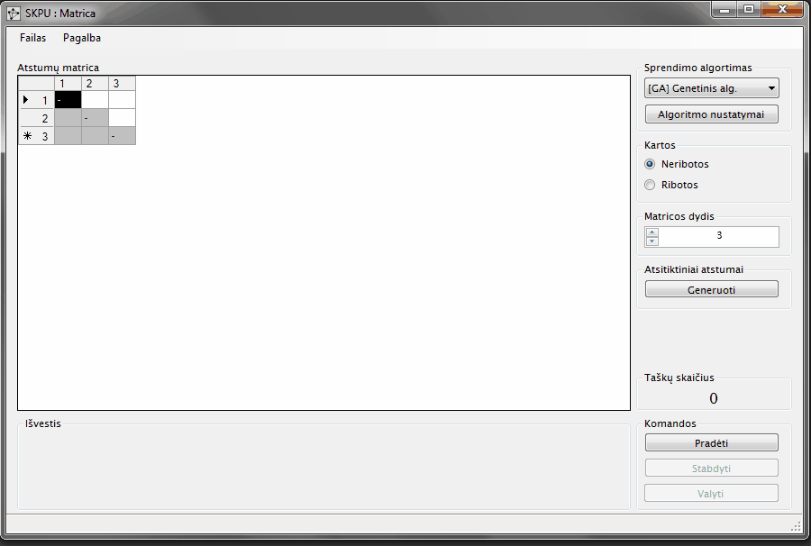

# Simulated annealing and genetic algorithms for symmetric travelling salesman problem

This is a **VB.NET** application that allows to analyse genetic algorithm and simulated annealing
algortihm performance in solving symmetric travelling salesman problem (TSP).

Input methods are random points, distance matrix and `.tsp` files.
Random points input method has a canvas where you visually see
TSP solution graph and how it changes as the selected algorithm attempts
to iteratively improve the solution. Program interface is in Lithuanian language.

## Symmetric Travelling Salesman Problem (Symmetric TSP)

The symmetric travelling salesman problem is defined as follows: find the
shortest Hamiltonian cycle (or tour) in a weighted finite undirected graph
without loops. TSP has applications in many fields, such as transportation,
logistics, network design and manufacturing.

## Genetic Algorithms

A genetic algorithm is an adaptive heuristic search algorithm based on
the evolutionary ideas of natural selection and genetic.
To use a genetic algorithm, one must represent a solution of a problem
as a chromosome. The genetic algorithm then creates a population of
solutions and applies genetic operators such as mutation and crossover
to evolve the solutions in order to find the best one(s).

## Simulated Annealing

Simulated annealing is a probabilistic random-search technique for the
global optimization problem which exploits an analogy between the way
in which a metal cools and freezes into a minimum energy crystalline
structure (the annealing process) and the search for a minimum in a
more general system.

## The Application

Application is written in **VB.NET** code.

